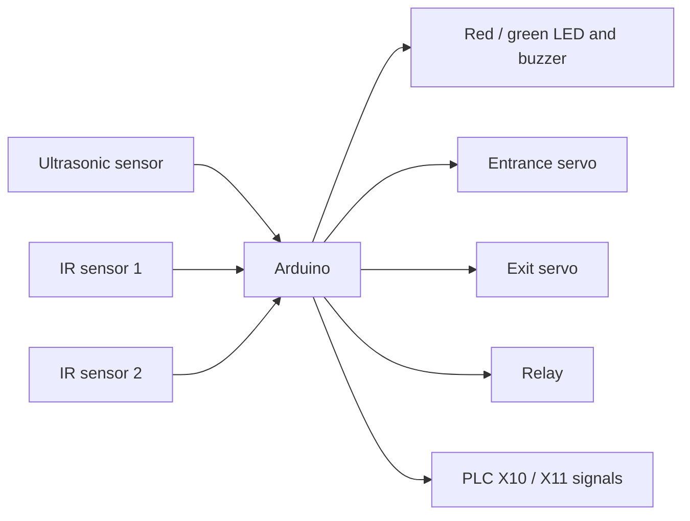

# PLC Parking System

Arduino 센서와 서보모터를 PLC 입출력 신호에 연동해 주차장 입구와 만차 상태를 제어한 팀 프로젝트입니다.

## Features

- 초음파 센서로 주차 공간의 거리 상태 확인
- 만차 조건에서 빨간 LED와 피에조 부저 작동
- 정상 상태에서 초록 LED 표시
- 두 개의 적외선 센서로 입구와 출구 차량 감지
- 두 개의 서보모터로 차단기 제어
- 릴레이와 `X10`, `X11` 신호를 통한 PLC 연동

## Repository layout

- `firmware/plc_parking_controller/`: 실제 작동에 사용한 최종 코드
- `firmware/parking_counter_demo/`: 3대 주차 카운트 시뮬레이션
- `firmware/plc_signal_test/`: PLC 릴레이와 입출력 신호 시험 코드
- `firmware/arduino_hardware_test/`: Arduino 센서·서보 시험 코드
- `firmware/simulation/`: 초기 시뮬레이션 코드
- `docs/presentation/`: 최종·초기 발표자료
- `docs/references/`: 모터 카운트와 PLC 연결 참고자료

## Main control flow

## Run the final sketch

1. Arduino IDE에서 `firmware/plc_parking_controller/plc_parking_controller.ino`를 엽니다.
2. 사용한 Arduino 보드와 포트를 선택합니다.
3. `Servo` 라이브러리를 확인한 뒤 스케치를 업로드합니다.
4. `docs/hardware.md`의 핀맵에 맞춰 센서, LED, 부저, 서보, 릴레이를 연결합니다.

최종 스케치는 보관된 작동 코드를 기준으로 하며 동작 로직은 변경하지 않았습니다.

## Safety

Arduino와 PLC 전압 영역을 직접 연결하지 말고 프로젝트에서 사용한 릴레이 또는 적절한 절연 회로를 사용해야 합니다. 배선 변경 전에는 전원을 차단하고, 실제 PLC 입력 전압과 릴레이 정격을 확인합니다.

## Related project

이 저장소는 Arduino·PLC 기반 주차장 제어 프로젝트입니다. ESP32-CAM, YOLO, Flask, Flutter로 구성한 후속 캡스톤은 별도 [`flask-parking-server`](https://github.com/JINHYUNDEOK/flask-parking-server) 저장소에서 관리합니다.

## Notes

팀 프로젝트 결과물이므로 별도 라이선스는 지정하지 않았습니다. 공개 재사용 전 팀 구성원의 동의를 확인해야 합니다.
